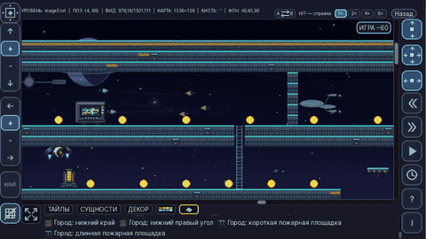

# Cat vs Ghosts

<a href="README.md">🇬🇧 English</a> · <strong>🇵🇱 Polski</strong> · <a href="README.ru.md">🇷🇺 Русский</a> · <a href="README.ua.md">🇺🇦 Українська</a>

  

<strong>Platformówka 2D na PC · Python · pygame-ce · własny edytor poziomów · Windows</strong>

**Cat vs Ghosts** to ukończona platformówka 2D rozwijana jako długoterminowy projekt w Pythonie. Z niewielkiego prototypu powstała pełna gra dla Windows z wieloetapową kampanią, profilami i zapisami, lokalizacją, własnymi narzędziami do tworzenia zawartości, kalibracją wydajności, optymalizacją GPU i procesem wydawniczym.

> **Status:** v1.0.0 — ukończona wersja Windows, przetestowana na starszym laptopie z hybrydową grafiką oraz na nowoczesnym laptopie z NVIDIA.

> **Kod źródłowy:** repozytorium produkcyjne jest prywatne. To publiczne repozytorium służy jako prezentacja portfolio i celowo nie publikuje pełnej implementacji gry ani edytora poziomów.

> **Rola:** autor projektu / Python developer — systemy rozgrywki, własny edytor poziomów, profilowanie i optymalizacja wydajności, integracja lokalizacji oraz proces pakowania i wydania wersji Windows.

## Rozgrywka

Kampania prowadzi przez wyraźnie różniące się środowiska zamiast korzystać wciąż z jednego zestawu graficznego.

<table>
  <tr><td width="50%"></td><td width="50%"></td></tr>
  <tr><td align="center"><b>Etap 1 · Las</b></td><td align="center"><b>Etap 2 · Burza</b></td></tr>
  <tr><td></td><td></td></tr>
  <tr><td align="center"><b>Etap 3 · Bagna</b></td><td align="center"><b>Etap 4 · Miasto</b></td></tr>
  <tr><td></td><td></td></tr>
  <tr><td align="center"><b>Etap 5 · Kosmos</b></td><td align="center"><b>Etap 6 · Nocny zamek</b></td></tr>
</table>

## Najważniejsze funkcje

- Wieloetapowa kampania z różnymi motywami wizualnymi i bossami
- Własny edytor poziomów używany do budowy i przebudowy kampanii
- Warstwa obiektów / rejestr pędzli dla wielokrotnego użycia elementów rozgrywki i dekoracyjnych
- Profile graczy, postęp kampanii, zapis/odczyt, ustawienia i zrzuty ekranu
- Obsługa klawiatury i myszy z modelem **last-input-wins**
- Lokalizacja na **angielski, polski, rosyjski i ukraiński**
- Automatyczna kalibracja wydajności dla różnych klas sprzętu
- Optymalizacje renderowania, w tym zoptymalizowane systemy tła
- Pakowanie wersji Windows przez **PyInstaller** i integracja instalatora
- Narzędzia profilujące używane tylko podczas prac rozwojowych są wykluczane z finalnej paczki

## Własny edytor poziomów

Edytor jest jedną z kluczowych części projektu i służy do tworzenia rzeczywistej zawartości kampanii.

<table>
  <tr><td width="50%"></td><td width="50%"></td></tr>
  <tr><td align="center"><b>Przegląd poziomu miejskiego</b></td><td align="center"><b>Przegląd poziomu kosmicznego</b></td></tr>
</table>

  

<em>Demo edytora - zoom, nawigacja, edycja obiektów i przegląd dużej mapy.</em>

<a href="assets/editor/editor-demo.mp4">▶ Obejrzyj demo MP4</a>

Obsługuje kilka poziomów zoomu, nawigację po dużych mapach, pędzle wielokrotnego użytku, obiekty dekoracyjne i gameplayowe, punkty kotwiczenia, wybór tła/motywu oraz bezpośrednie testowanie edytowanych etapów. Warstwa obiektów jest oparta na rejestrze, dzięki czemu nową zawartość można dodawać bez kodowania każdego elementu osobno na sztywno.

## Stos technologiczny

| Obszar | Technologia |
| --- | --- |
| Język | Python 3.10 |
| Framework gry | pygame-ce 2.5.2 |
| Obliczenia pomocnicze | NumPy 2.2.6 |
| Pakowanie | PyInstaller |
| Instalator Windows | Inno Setup |
| Kontrola wersji | Git / GitHub |
| Platforma docelowa | Windows |

## Najważniejsze elementy inżynierskie

### Wydajność zależna od sprzętu
Gra zawiera automatyczny benchmark/kalibrację, który mierzy obciążenia renderowania i logiki oraz zapisuje lokalny profil wydajności. Optymalizacje testowano zarówno na nowoczesnym sprzęcie, jak i na starszym laptopie z hybrydową grafiką Intel/NVIDIA. Wersję Windows sprawdzono również na laptopie z NVIDIA RTX 3060.

### Proces tworzenia zawartości
Obiekty są opisane w rejestrze zamiast być kodowane indywidualnie bezpośrednio w danych poziomów. Metadane pędzli mogą zawierać odwołania do assetów, kotwice, role w rozgrywce i informacje związane z wydajnością.

### Rozdzielenie release/debug
Konfiguracja PyInstaller jawnie wyklucza moduły profilera przeznaczone tylko do developmentu, jednocześnie pakując wymagane assety i poziomy.

### Lokalizacja i dane gracza
Gra obsługuje EN / PL / RU / UA przez system tłumaczeń oparty na kluczach z angielskim jako językiem zapasowym. Profile, zapisy, postęp kampanii i ustawienia są przechowywane poza katalogiem spakowanej aplikacji.

## Status projektu
**Cat vs Ghosts 1.0.0** jest ukończony. To repozytorium jest publiczną prezentacją portfolio; produkcyjny kod źródłowy i wersja Windows nie są tutaj dystrybuowane.

## Autor
**Vitalii Butsanov**
Python developer / personal software projects

GitHub: [vitaliibutsanov](https://github.com/vitaliibutsanov)

## Licencja
Ta prezentacja jest udostępniana na podstawie własnej licencji portfolio. Szczegóły znajdują się w pliku [LICENSE](LICENSE).
