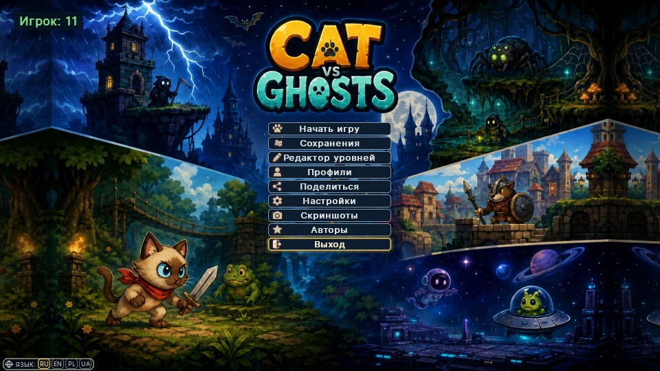
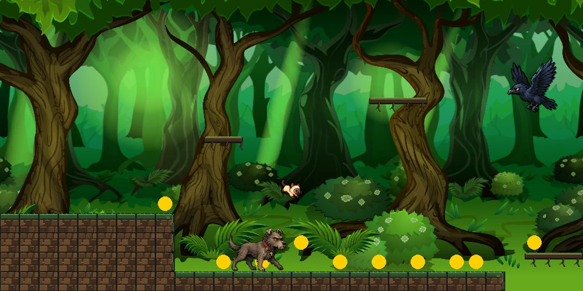
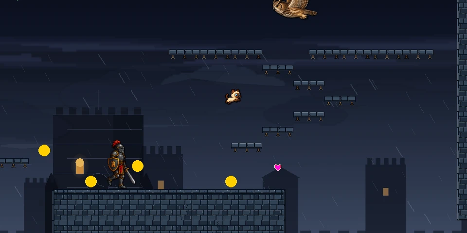
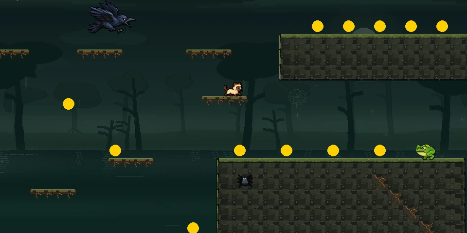
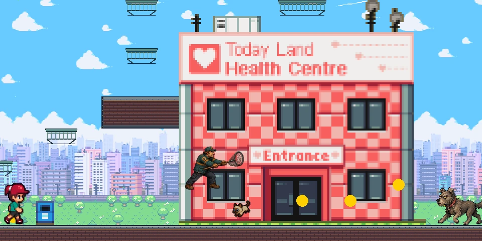
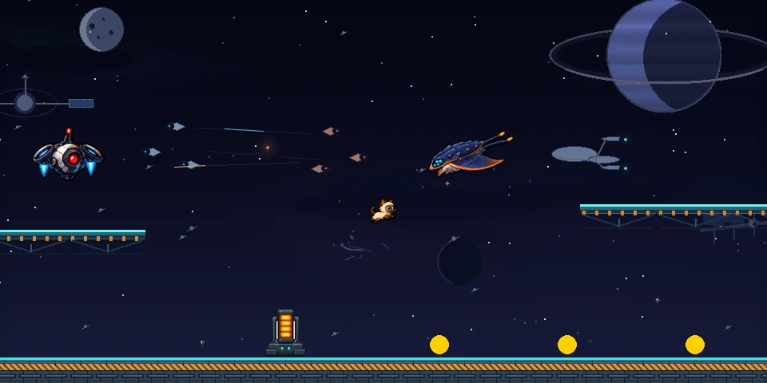
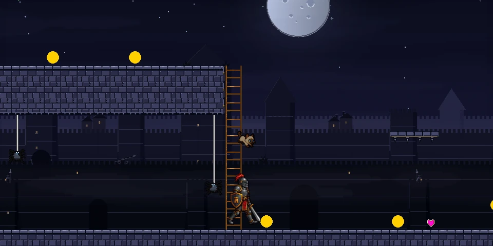
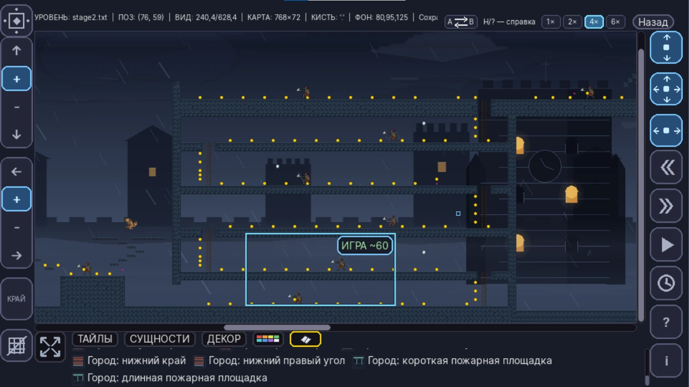
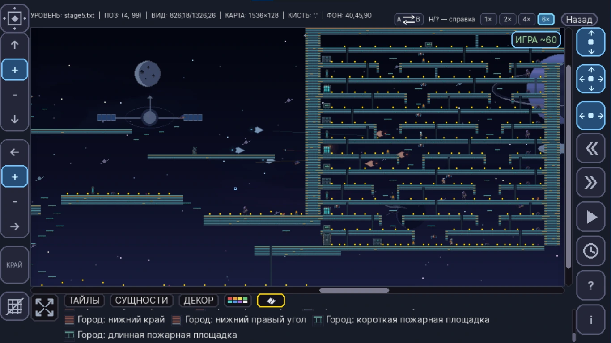

# Cat vs Ghosts

<a href="README.md">🇬🇧 English</a> · <a href="README.pl.md">🇵🇱 Polski</a> · <a href="README.ru.md">🇷🇺 Русский</a> · <strong>🇺🇦 Українська</strong>

  

<strong>2D desktop platformer · Python · pygame-ce · власний редактор рівнів · Windows</strong>

**Cat vs Ghosts** — завершений 2D-платформер, розроблений як довготривалий особистий проєкт на Python. Невеликий прототип поступово перетворився на повноцінну Windows-гру з багатоетапною кампанією, профілями та збереженнями, локалізацією, власними інструментами створення контенту, калібрацією продуктивності, GPU-оптимізацією та release pipeline.

> **Статус:** v1.0.0 — Windows-збірку завершено та протестовано як на старішому ноутбуці з гібридною графікою, так і на сучасному ноутбуці з NVIDIA.

> **Вихідний код:** production-репозиторій залишається приватним. Цей публічний репозиторій створено як showcase для портфоліо й навмисно не публікує повний код гри та редактора рівнів.

## Ігровий процес

Кампанія проходить через візуально різні світи, а не будується на багаторазовому використанні одного й того самого набору графіки.

<table>
  <tr><td width="50%"></td><td width="50%"></td></tr>
  <tr><td align="center"><b>Етап 1 · Ліс</b></td><td align="center"><b>Етап 2 · Гроза</b></td></tr>
  <tr><td></td><td></td></tr>
  <tr><td align="center"><b>Етап 3 · Болото</b></td><td align="center"><b>Етап 4 · Місто</b></td></tr>
  <tr><td></td><td></td></tr>
  <tr><td align="center"><b>Етап 5 · Космос</b></td><td align="center"><b>Етап 6 · Нічний замок</b></td></tr>
</table>

## Ключові можливості

- Багатоетапна платформна кампанія з різними візуальними темами та босами
- Власний редактор рівнів, використаний для створення й переробки кампанії
- Object-layer / registry пензлів для повторного використання ігрових і декоративних об’єктів
- Профілі гравців, прогрес кампанії, збереження/завантаження, налаштування та скріншоти
- Навігація клавіатурою й мишею за моделлю **last-input-wins**
- Локалізація **англійською, польською, російською та українською**
- Автоматична калібрація продуктивності під різні класи обладнання
- Оптимізація рендерингу, зокрема оптимізовані фонові пайплайни
- Windows-збірка через **PyInstaller** та інтеграція інсталятора
- Development-only профайлери виключаються з фінальної збірки

## Власний редактор рівнів

Редактор став однією з ключових частин проєкту й використовується для справжніх рівнів кампанії.

<table>
  <tr><td width="50%"></td><td width="50%"></td></tr>
  <tr><td align="center"><b>Огляд міського рівня</b></td><td align="center"><b>Огляд космічного рівня</b></td></tr>
</table>

Редактор підтримує кілька масштабів, навігацію великими картами, повторно використовувані пензлі, декоративні та ігрові сутності, anchors об’єктів, вибір фону/теми та прямий запуск тесту редагованого етапу. Object-layer побудований навколо registry, тому новий контент можна додавати без окремого hard-code для кожного об’єкта.

## Технології

| Сфера | Технологія |
| --- | --- |
| Мова | Python 3.10 |
| Ігровий framework | pygame-ce 2.5.2 |
| Числові операції | NumPy 2.2.6 |
| Packaging | PyInstaller |
| Windows installer | Inno Setup |
| Version control | Git / GitHub |
| Цільова платформа | Windows |

## Інженерні особливості

### Робота з продуктивністю на різному обладнанні
Гра містить автоматичний benchmark/calibration етап, який вимірює навантаження рендерингу й логіки та зберігає локальний профіль продуктивності. Оптимізацію перевіряли і на сучасному обладнанні, і на старішому ноутбуці з гібридною Intel/NVIDIA-графікою. Windows-реліз також перевірено на ноутбуці з NVIDIA RTX 3060.

### Content pipeline
Об’єкти описуються через registry замість індивідуального hard-code безпосередньо в даних рівня. Метадані пензлів можуть містити asset references, anchors, gameplay roles та інформацію, пов’язану з продуктивністю.

### Розділення release/debug
Конфігурація PyInstaller явно виключає development-only модулі профайлера, водночас пакуючи потрібні runtime assets і рівні.

### Локалізація та дані гравця
Гра підтримує EN / PL / RU / UA через систему перекладів за ключами з англійським fallback. Профілі, збереження, прогрес кампанії та налаштування зберігаються поза каталогом упакованої програми.

## Межі публічного портфоліо
Цей репозиторій демонструє завершений проєкт без публікації повної proprietary-реалізації гри або редактора рівнів.

## Поточний реліз
**Cat vs Ghosts 1.0.0** — перша завершена Windows-версія.

## Автор
**Vitalii Butsanov**
Python developer / personal software projects

GitHub: [vitaliibutsanov](https://github.com/vitaliibutsanov)

## Ліцензія
Copyright © 2026 Vitalii Butsanov. All rights reserved.
